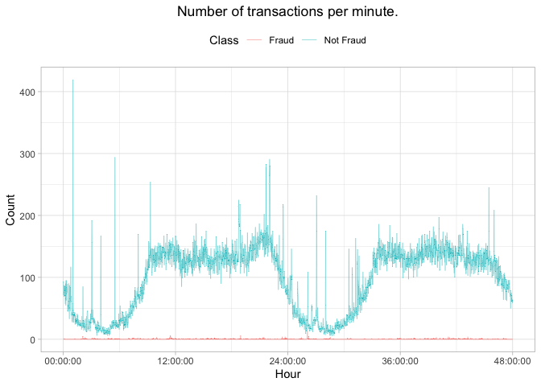
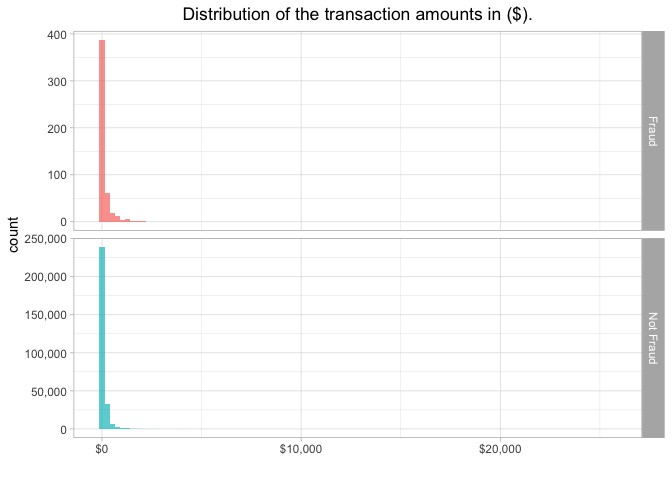
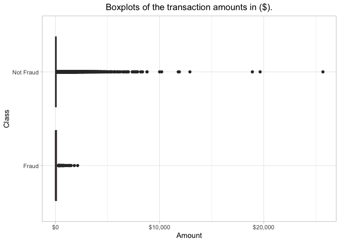
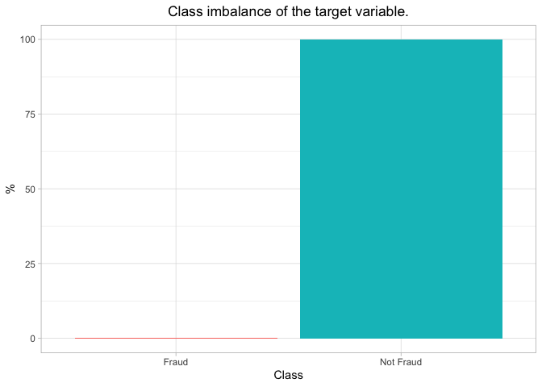
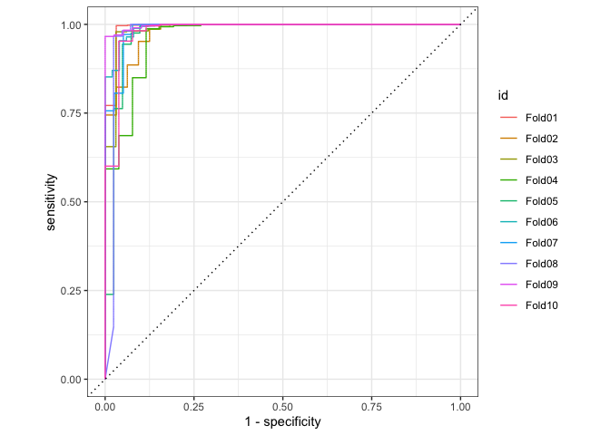
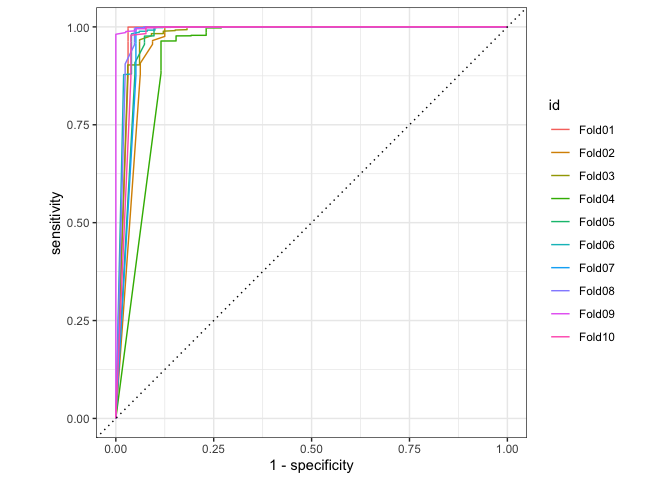
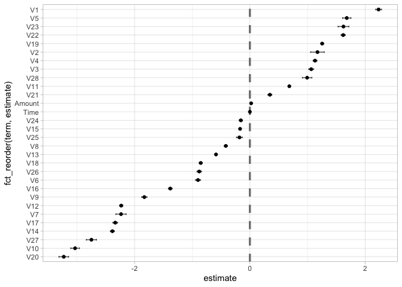

Credit Card Fraud Detection Kaggle
================
Andrea Ranzato
11/1/2020

# Motivation

(WORK IN PROGRESS)

I use the Credit Card Fraud Detection data set available on
[Kaggle.com](https://www.kaggle.com/mlg-ulb/creditcardfraud) in order to
practice the the Tidymodels meta-package. The objective of the this
analysis is to train a classifier able to predict credit card fraudulent
transactions.

The [screencast](https://www.youtube.com/watch?v=9f6t5vaNyEM) by [Julia
Silge](https://juliasilge.com) was extremely helpful in guiding me
through the steps of the Tidymodels framework.

``` r
library(tidyverse)
library(knitr)
library(scales)
library(lubridate)
theme_set(theme_light())
```

## Content

This section is pasted from
<https://www.kaggle.com/mlg-ulb/creditcardfraud>.

The datasets contains transactions made by credit cards in September
2013 by european cardholders. This dataset presents transactions that
occurred in two days, where we have 492 frauds out of 284,807
transactions. The dataset is highly unbalanced, the positive class
(frauds) account for 0.172% of all transactions.

It contains only numerical input variables which are the result of a PCA
transformation. Unfortunately, due to confidentiality issues, we cannot
provide the original features and more background information about the
data. Features V1, V2, … V28 are the principal components obtained with
PCA, the only features which have not been transformed with PCA are
‘Time’ and ‘Amount’. Feature ‘Time’ contains the seconds elapsed
between each transaction and the first transaction in the dataset. The
feature ‘Amount’ is the transaction Amount, this feature can be used for
example-dependant cost-senstive learning. Feature ‘Class’ is the
response variable and it takes value 1 in case of fraud and 0 otherwise.

## Explore data

``` r
df <- read_csv("data/creditcard.csv")
skimr::skim(df)
```

|                                                  |        |
| :----------------------------------------------- | :----- |
| Name                                             | df     |
| Number of rows                                   | 284807 |
| Number of columns                                | 31     |
| \_\_\_\_\_\_\_\_\_\_\_\_\_\_\_\_\_\_\_\_\_\_\_   |        |
| Column type frequency:                           |        |
| numeric                                          | 31     |
| \_\_\_\_\_\_\_\_\_\_\_\_\_\_\_\_\_\_\_\_\_\_\_\_ |        |
| Group variables                                  | None   |

Data summary

**Variable type: numeric**

| skim\_variable | n\_missing | complete\_rate |     mean |       sd |       p0 |      p25 |      p50 |       p75 |      p100 | hist  |
| :------------- | ---------: | -------------: | -------: | -------: | -------: | -------: | -------: | --------: | --------: | :---- |
| Time           |          0 |              1 | 94813.86 | 47488.15 |     0.00 | 54201.50 | 84692.00 | 139320.50 | 172792.00 | ▃▇▅▆▇ |
| V1             |          0 |              1 |     0.00 |     1.96 |  \-56.41 |   \-0.92 |     0.02 |      1.32 |      2.45 | ▁▁▁▁▇ |
| V2             |          0 |              1 |     0.00 |     1.65 |  \-72.72 |   \-0.60 |     0.07 |      0.80 |     22.06 | ▁▁▁▇▁ |
| V3             |          0 |              1 |     0.00 |     1.52 |  \-48.33 |   \-0.89 |     0.18 |      1.03 |      9.38 | ▁▁▁▁▇ |
| V4             |          0 |              1 |     0.00 |     1.42 |   \-5.68 |   \-0.85 |   \-0.02 |      0.74 |     16.88 | ▂▇▁▁▁ |
| V5             |          0 |              1 |     0.00 |     1.38 | \-113.74 |   \-0.69 |   \-0.05 |      0.61 |     34.80 | ▁▁▁▇▁ |
| V6             |          0 |              1 |     0.00 |     1.33 |  \-26.16 |   \-0.77 |   \-0.27 |      0.40 |     73.30 | ▁▇▁▁▁ |
| V7             |          0 |              1 |     0.00 |     1.24 |  \-43.56 |   \-0.55 |     0.04 |      0.57 |    120.59 | ▁▇▁▁▁ |
| V8             |          0 |              1 |     0.00 |     1.19 |  \-73.22 |   \-0.21 |     0.02 |      0.33 |     20.01 | ▁▁▁▇▁ |
| V9             |          0 |              1 |     0.00 |     1.10 |  \-13.43 |   \-0.64 |   \-0.05 |      0.60 |     15.59 | ▁▁▇▁▁ |
| V10            |          0 |              1 |     0.00 |     1.09 |  \-24.59 |   \-0.54 |   \-0.09 |      0.45 |     23.75 | ▁▁▇▁▁ |
| V11            |          0 |              1 |     0.00 |     1.02 |   \-4.80 |   \-0.76 |   \-0.03 |      0.74 |     12.02 | ▁▇▁▁▁ |
| V12            |          0 |              1 |     0.00 |     1.00 |  \-18.68 |   \-0.41 |     0.14 |      0.62 |      7.85 | ▁▁▁▇▁ |
| V13            |          0 |              1 |     0.00 |     1.00 |   \-5.79 |   \-0.65 |   \-0.01 |      0.66 |      7.13 | ▁▃▇▁▁ |
| V14            |          0 |              1 |     0.00 |     0.96 |  \-19.21 |   \-0.43 |     0.05 |      0.49 |     10.53 | ▁▁▁▇▁ |
| V15            |          0 |              1 |     0.00 |     0.92 |   \-4.50 |   \-0.58 |     0.05 |      0.65 |      8.88 | ▁▇▂▁▁ |
| V16            |          0 |              1 |     0.00 |     0.88 |  \-14.13 |   \-0.47 |     0.07 |      0.52 |     17.32 | ▁▁▇▁▁ |
| V17            |          0 |              1 |     0.00 |     0.85 |  \-25.16 |   \-0.48 |   \-0.07 |      0.40 |      9.25 | ▁▁▁▇▁ |
| V18            |          0 |              1 |     0.00 |     0.84 |   \-9.50 |   \-0.50 |     0.00 |      0.50 |      5.04 | ▁▁▂▇▁ |
| V19            |          0 |              1 |     0.00 |     0.81 |   \-7.21 |   \-0.46 |     0.00 |      0.46 |      5.59 | ▁▁▇▂▁ |
| V20            |          0 |              1 |     0.00 |     0.77 |  \-54.50 |   \-0.21 |   \-0.06 |      0.13 |     39.42 | ▁▁▇▁▁ |
| V21            |          0 |              1 |     0.00 |     0.73 |  \-34.83 |   \-0.23 |   \-0.03 |      0.19 |     27.20 | ▁▁▇▁▁ |
| V22            |          0 |              1 |     0.00 |     0.73 |  \-10.93 |   \-0.54 |     0.01 |      0.53 |     10.50 | ▁▁▇▁▁ |
| V23            |          0 |              1 |     0.00 |     0.62 |  \-44.81 |   \-0.16 |   \-0.01 |      0.15 |     22.53 | ▁▁▁▇▁ |
| V24            |          0 |              1 |     0.00 |     0.61 |   \-2.84 |   \-0.35 |     0.04 |      0.44 |      4.58 | ▁▇▆▁▁ |
| V25            |          0 |              1 |     0.00 |     0.52 |  \-10.30 |   \-0.32 |     0.02 |      0.35 |      7.52 | ▁▁▇▂▁ |
| V26            |          0 |              1 |     0.00 |     0.48 |   \-2.60 |   \-0.33 |   \-0.05 |      0.24 |      3.52 | ▁▆▇▁▁ |
| V27            |          0 |              1 |     0.00 |     0.40 |  \-22.57 |   \-0.07 |     0.00 |      0.09 |     31.61 | ▁▁▇▁▁ |
| V28            |          0 |              1 |     0.00 |     0.33 |  \-15.43 |   \-0.05 |     0.01 |      0.08 |     33.85 | ▁▇▁▁▁ |
| Amount         |          0 |              1 |    88.35 |   250.12 |     0.00 |     5.60 |    22.00 |     77.16 |  25691.16 | ▇▁▁▁▁ |
| Class          |          0 |              1 |     0.00 |     0.04 |     0.00 |     0.00 |     0.00 |      0.00 |      1.00 | ▇▁▁▁▁ |

``` r
# Divide Time in bins of 60 seconds
trans_min <- df %>% 
  group_by(seconds = 60 * (Time %/% 60 + 1)) %>% 
  summarise(n_transaction = n(), 
            fraud = sum(Class), 
            not_fraud = n() - sum(Class),
            perc_fraud = mean(Class)*100,
            perc_not_fraud = (1 - mean(Class))*100) %>% 
  mutate(minute = seconds/60) %>% 
  relocate(minute, .after = seconds) 
```

``` r
trans_min %>% 
  select(seconds, fraud, not_fraud) %>% 
  pivot_longer(fraud:not_fraud, names_to = "Class", values_to = "n") %>% 
  mutate(Class = if_else(Class == "fraud", "Fraud", "Not Fraud"),
         seconds = hms::hms(seconds)) %>% 
  ggplot(aes(seconds, n, colour = Class)) +
  geom_line(size = 0.15) +
  scale_x_time(breaks = scales::breaks_width("12 hour")) +
  #scale_y_continuous(limits = c(0, 300)) +
  theme(legend.position = "top",
        plot.title = element_text(hjust = 0.5)) +
  labs(y = "Count",
       x = "Hour",
       title = "Number of transactions per minute.")
```



Seasonality in the datetime and night-time.

``` r
df %>% 
  select(-contains("V")) %>% 
  mutate(Class = as.character(Class),
         Class = if_else(Class == "1", "Fraud", "Not Fraud")) %>% 
  #filter(Class == "Fraud") %>% 
  ggplot(aes(Amount, fill = Class)) +
  geom_histogram(position = "identity", alpha = 0.7, bins = 100) +
  scale_x_continuous(labels = scales::label_dollar()) +
  scale_y_continuous(labels = scales::comma_format()) +
  facet_grid(Class ~ ., scales = "free") +
  theme(plot.title = element_text(hjust = 0.5),
        legend.position = "none") +
  labs(title = "Distribution of the transaction amounts in ($).", x = "")
```



``` r
df %>% 
  select(-contains("V")) %>% 
  mutate(Class = as.character(Class),
         Class = if_else(Class == "1", "Fraud", "Not Fraud")) %>% 
  #filter(Class == "Fraud") %>% 
  ggplot(aes(Class, Amount, fill = Class)) +
  geom_boxplot() +
  scale_y_continuous(labels = scales::label_dollar()) +
  theme(plot.title = element_text(hjust = 0.5),
        legend.position = "none") +
  labs(title = "Boxplots of the transaction amounts in ($).") +
  coord_flip()
```



``` r
df %>% 
  mutate(Class = if_else(Class == "1", "Fraud", "Not Fraud")) %>% 
  group_by(Class) %>% 
  summarise(min_amt = min(Amount), 
            first_q_amt = quantile(Amount, 0.25),
            median_amt = median(Amount), 
            mean_amt = mean(Amount), 
            third_q_amt = quantile(Amount, 0.75),
            max_amt = max(Amount),
            sd = sd(Amount)) %>% 
  kable(digits = 2, format.args = list(big.mark = ",", scientific = FALSE),
        col.names = c("Class", "Min.", "1st Q.", "Median", "Mean", "3rd Q.", "Max.", "Sd."))
```

| Class     | Min. | 1st Q. | Median |   Mean | 3rd Q. |      Max. |    Sd. |
| :-------- | ---: | -----: | -----: | -----: | -----: | --------: | -----: |
| Fraud     |    0 |   1.00 |   9.25 | 122.21 | 105.89 |  2,125.87 | 256.68 |
| Not Fraud |    0 |   5.65 |  22.00 |  88.29 |  77.05 | 25,691.16 | 250.11 |

``` r
df %>% 
  summarise(across(everything(), ~ sum(is.na(.)))) %>% 
  pivot_longer(everything(), names_to = "Feature", values_to = "NAs_Numb") %>% 
  filter(NAs_Numb != 0)
```

    ## # A tibble: 0 x 2
    ## # … with 2 variables: Feature <chr>, NAs_Numb <int>

``` r
# No NA detected
```

``` r
target <- df %>% 
  mutate(Class = if_else(Class == 0, "Not Fraud", "Fraud")) %>% 
  group_by(Class) %>% 
  summarise(n = n(), perc = (n()/nrow(df))*100)

target %>% 
  ggplot(aes(x = Class, y = perc, fill = Class)) +
  geom_bar(stat = "identity") +
  theme(plot.title = element_text(hjust = 0.5),
        legend.position = "none") +
  labs(y = "%",
       title = "Class imbalance of the target variable.")
```



``` r
 target %>% 
  kable(digits = 2, format.args = list(big.mark = ",", scientific = FALSE),
        caption = "Frequency of Frauds on Credit Cards.",
        col.names = c("Class", "Total", "Percentage"))
```

| Class     |   Total | Percentage |
| :-------- | ------: | ---------: |
| Fraud     |     492 |       0.17 |
| Not Fraud | 284,315 |      99.83 |

Frequency of Frauds on Credit Cards.

## Build models

Since the target variable *Class* is affected by class imbalance, we use
stratified random sampling in order to keep the proportion of fraudulent
transaction similar in both train and test set.

``` r
library(tidymodels)

df <- df %>% 
  mutate(Class = factor(Class))

# Train and test with stratified random sampling
set.seed(1234)
trans_split <- initial_split(df, strata = Class)
trans_train <- training(trans_split)
trans_test <- testing(trans_split) 

set.seed(345)

# Create cross validations folds from the training
# used to make choices.
# Empirical method to evaluate models.
trans_folds <- vfold_cv(trans_train)
```

``` r
library(themis)
trans_rec <- recipe(Class ~ ., data = trans_train) %>% 
  step_smote(Class)
  # Synthetic observations.
  # It makes new examples of fraudulent transactions in order to have the same 
  # proportion of 0 and 1.
  # By doing so, enanched learning process.

trans_wf <- workflow() %>% 
  add_recipe(trans_rec)

trans_wf
```

    ## ══ Workflow ═══════════════════════════════════════════════════════════════════════════════════════════
    ## Preprocessor: Recipe
    ## Model: None
    ## 
    ## ── Preprocessor ───────────────────────────────────────────────────────────────────────────────────────
    ## 1 Recipe Step
    ## 
    ## ● step_smote()

``` r
glm_spec <- logistic_reg() %>% 
  set_engine("glm")

rf_spec <- rand_forest(trees = 100) %>% 
  set_engine("ranger") %>% 
  set_mode("classification")
```

``` r
doParallel::registerDoParallel()

# Not strong reasons to tune
glm_rs <- trans_wf %>% 
  add_model(glm_spec) %>% 
  fit_resamples(
    resamples = trans_folds,
    metrics = metric_set(roc_auc, accuracy, sensitivity, specificity),
    control = control_resamples(save_pred = TRUE)
  )
glm_rs
```

    ## Warning: This tuning result has notes. Example notes on model fitting include:
    ## model: glm.fit: algorithm did not converge, glm.fit: fitted probabilities numerically 0 or 1 occurred
    ## model: glm.fit: fitted probabilities numerically 0 or 1 occurred
    ## model: glm.fit: fitted probabilities numerically 0 or 1 occurred

    ## # Resampling results
    ## # 10-fold cross-validation 
    ## # A tibble: 10 x 5
    ##    splits               id     .metrics       .notes         .predictions       
    ##    <list>               <chr>  <list>         <list>         <list>             
    ##  1 <split [192.2K/21.4… Fold01 <tibble [4 × … <tibble [1 × … <tibble [21,361 × …
    ##  2 <split [192.2K/21.4… Fold02 <tibble [4 × … <tibble [1 × … <tibble [21,361 × …
    ##  3 <split [192.2K/21.4… Fold03 <tibble [4 × … <tibble [1 × … <tibble [21,361 × …
    ##  4 <split [192.2K/21.4… Fold04 <tibble [4 × … <tibble [1 × … <tibble [21,361 × …
    ##  5 <split [192.2K/21.4… Fold05 <tibble [4 × … <tibble [1 × … <tibble [21,361 × …
    ##  6 <split [192.2K/21.4… Fold06 <tibble [4 × … <tibble [1 × … <tibble [21,361 × …
    ##  7 <split [192.2K/21.4… Fold07 <tibble [4 × … <tibble [1 × … <tibble [21,360 × …
    ##  8 <split [192.2K/21.4… Fold08 <tibble [4 × … <tibble [1 × … <tibble [21,360 × …
    ##  9 <split [192.2K/21.4… Fold09 <tibble [4 × … <tibble [1 × … <tibble [21,360 × …
    ## 10 <split [192.2K/21.4… Fold10 <tibble [4 × … <tibble [1 × … <tibble [21,360 × …

``` r
doParallel::registerDoParallel()

# Not strong reasong to tune
rf_rs <- trans_wf %>% 
  add_model(rf_spec) %>% 
  fit_resamples(
    resamples = trans_folds,
    metrics = metric_set(roc_auc, accuracy, sensitivity, specificity),
    control = control_resamples(save_pred = TRUE)
  )
rf_rs
```

    ## # Resampling results
    ## # 10-fold cross-validation 
    ## # A tibble: 10 x 5
    ##    splits               id     .metrics       .notes         .predictions       
    ##    <list>               <chr>  <list>         <list>         <list>             
    ##  1 <split [192.2K/21.4… Fold01 <tibble [4 × … <tibble [0 × … <tibble [21,361 × …
    ##  2 <split [192.2K/21.4… Fold02 <tibble [4 × … <tibble [0 × … <tibble [21,361 × …
    ##  3 <split [192.2K/21.4… Fold03 <tibble [4 × … <tibble [0 × … <tibble [21,361 × …
    ##  4 <split [192.2K/21.4… Fold04 <tibble [4 × … <tibble [0 × … <tibble [21,361 × …
    ##  5 <split [192.2K/21.4… Fold05 <tibble [4 × … <tibble [0 × … <tibble [21,361 × …
    ##  6 <split [192.2K/21.4… Fold06 <tibble [4 × … <tibble [0 × … <tibble [21,361 × …
    ##  7 <split [192.2K/21.4… Fold07 <tibble [4 × … <tibble [0 × … <tibble [21,360 × …
    ##  8 <split [192.2K/21.4… Fold08 <tibble [4 × … <tibble [0 × … <tibble [21,360 × …
    ##  9 <split [192.2K/21.4… Fold09 <tibble [4 × … <tibble [0 × … <tibble [21,360 × …
    ## 10 <split [192.2K/21.4… Fold10 <tibble [4 × … <tibble [0 × … <tibble [21,360 × …

## Evaluate models

``` r
collect_metrics(glm_rs)
```

    ## # A tibble: 4 x 5
    ##   .metric  .estimator  mean     n  std_err
    ##   <chr>    <chr>      <dbl> <int>    <dbl>
    ## 1 accuracy binary     0.992    10 0.000187
    ## 2 roc_auc  binary     0.984    10 0.00311 
    ## 3 sens     binary     0.992    10 0.000195
    ## 4 spec     binary     0.894    10 0.0128

``` r
collect_metrics(rf_rs)
```

    ## # A tibble: 4 x 5
    ##   .metric  .estimator  mean     n   std_err
    ##   <chr>    <chr>      <dbl> <int>     <dbl>
    ## 1 accuracy binary     1.00     10 0.0000363
    ## 2 roc_auc  binary     0.974    10 0.00567  
    ## 3 sens     binary     1.00     10 0.0000182
    ## 4 spec     binary     0.844    10 0.0209

``` r
glm_rs %>% 
  conf_mat_resampled()
```

    ## # A tibble: 4 x 3
    ##   Prediction Truth    Freq
    ##   <fct>      <fct>   <dbl>
    ## 1 0          0     21153. 
    ## 2 0          1         3.7
    ## 3 1          0       171. 
    ## 4 1          1        32.3

``` r
rf_rs %>% 
  conf_mat_resampled()
```

    ## # A tibble: 4 x 3
    ##   Prediction Truth    Freq
    ##   <fct>      <fct>   <dbl>
    ## 1 0          0     21321. 
    ## 2 0          1         5.5
    ## 3 1          0         3.8
    ## 4 1          1        30.5

``` r
glm_rs %>% 
  collect_predictions() %>% 
  group_by(id) %>% 
  roc_curve(Class, .pred_0) %>% 
  autoplot()
```



``` r
rf_rs %>% 
  collect_predictions() %>% 
  group_by(id) %>% 
  roc_curve(Class, .pred_0) %>% 
  autoplot()
```



``` r
# Train and evaluate on testinting data
trans_final <- trans_wf %>% 
  add_model(glm_spec) %>% 
  last_fit(trans_split)

# Metrics on testing data
collect_metrics(trans_final)
```

    ## # A tibble: 2 x 3
    ##   .metric  .estimator .estimate
    ##   <chr>    <chr>          <dbl>
    ## 1 accuracy binary         0.992
    ## 2 roc_auc  binary         0.960

``` r
collect_predictions(trans_final) %>% 
  conf_mat(Class, .pred_class)
```

    ##           Truth
    ## Prediction     0     1
    ##          0 70505    21
    ##          1   564   111

``` r
trans_final %>% 
  pull(.workflow) %>% 
  pluck(1) %>% 
  # Odds ratios
  tidy(exponentiate = TRUE) %>% 
  # First are predictors that make the prob of a trans. being fraudolent lower
  arrange(estimate) %>% 
  kable(digits = 3)
```

| term        | estimate | std.error | statistic | p.value |
| :---------- | -------: | --------: | --------: | ------: |
| (Intercept) |    0.001 |     0.109 |  \-63.481 |       0 |
| V20         |    0.040 |     0.084 |  \-38.603 |       0 |
| V10         |    0.048 |     0.075 |  \-40.294 |       0 |
| V27         |    0.064 |     0.088 |  \-31.288 |       0 |
| V14         |    0.092 |     0.035 |  \-67.580 |       0 |
| V17         |    0.097 |     0.041 |  \-57.299 |       0 |
| V7          |    0.107 |     0.090 |  \-24.850 |       0 |
| V12         |    0.107 |     0.029 |  \-76.631 |       0 |
| V9          |    0.160 |     0.046 |  \-40.027 |       0 |
| V16         |    0.251 |     0.033 |  \-42.297 |       0 |
| V6          |    0.407 |     0.045 |  \-20.048 |       0 |
| V26         |    0.415 |     0.039 |  \-22.802 |       0 |
| V18         |    0.426 |     0.028 |  \-30.520 |       0 |
| V13         |    0.556 |     0.015 |  \-38.773 |       0 |
| V8          |    0.659 |     0.028 |  \-14.848 |       0 |
| V25         |    0.834 |     0.051 |   \-3.591 |       0 |
| V15         |    0.844 |     0.016 |  \-10.597 |       0 |
| V24         |    0.855 |     0.028 |   \-5.509 |       0 |
| Time        |    1.000 |     0.000 |  \-33.031 |       0 |
| Amount      |    1.022 |     0.001 |    21.030 |       0 |
| V21         |    1.414 |     0.034 |    10.125 |       0 |
| V11         |    1.981 |     0.019 |    36.030 |       0 |
| V28         |    2.699 |     0.082 |    12.037 |       0 |
| V3          |    2.897 |     0.043 |    24.825 |       0 |
| V4          |    3.097 |     0.033 |    34.168 |       0 |
| V2          |    3.230 |     0.118 |     9.931 |       0 |
| V19         |    3.504 |     0.027 |    46.652 |       0 |
| V22         |    5.047 |     0.037 |    43.622 |       0 |
| V23         |    5.070 |     0.094 |    17.303 |       0 |
| V5          |    5.369 |     0.073 |    22.963 |       0 |
| V1          |    9.326 |     0.050 |    44.236 |       0 |

``` r
trans_final %>% 
  pull(.workflow) %>% 
  pluck(1) %>% 
  # Odds ratios
  tidy() %>% 
  filter(term != "(Intercept)") %>% 
  ggplot(aes(estimate, fct_reorder(term, estimate))) +
  geom_vline(xintercept = 0, colour = "grey50", lty = 2, size = 1.2) +
  geom_errorbar(aes(xmin = estimate - std.error,
                    xmax = estimate + std.error),
                width = 0.2, alpha = 0.7) +
  geom_point()
```



``` r
# On the positive side are the predictors that increase the likelihood of making a transaction fraudulent

# On the negative side are the predictors that decrease the likelihood of making a transaction fraudulent
```
